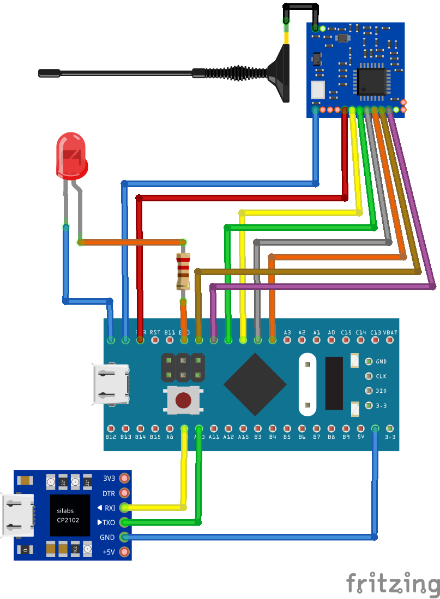

# STM32 LoRa Receiver 
# (STM32F411CEU6 + SX1278 + UART)

## Description

This project implements the receiver MCU in a two-node LoRa communication system.
It uses an STM32F411CEU6 microcontroller to receive LoRa packets from a paired transmitter and forward the data via UART.

---

## Connections

## SX1278 (LoRa) → STM32

| SX1278 | STM32 | Description     |
| ------ | ----- | --------------- |
| VCC    | 3.3V  | Power           |
| GND    | GND   | Ground          |
| NSS    | PA4   | SPI Chip Select |
| SCK    | PA5   | SPI Clock       |
| MISO   | PA6   | SPI MISO        |
| MOSI   | PA7   | SPI MOSI        |
| RESET  | PB0   | Reset           |
| DIO0   | PB1   | Interrupt       |  

> SPI pins may vary depending on your microcontroller.

## UART
| Device | STM32     | Description                   |
| ------ | --------- | ----------------------------- |
| GND    | GND       | Ground                        |
| TX     | RX (PA10) | UART Receive  |
| RX     | TX (PA9)  | UART Transmit  |

> Recommended UART baud rate: **115200 bps** (adjustable in code)

---
## Circuit Diagram

---
## Main loop

1. Initialize peripherals
2. Enter LoRa receive mode
3. Wait for incoming packet
4. Read received packet
5. Process/display data (temperature, humidity, etc.)

---
#  Author

### Vadym Minder

---

